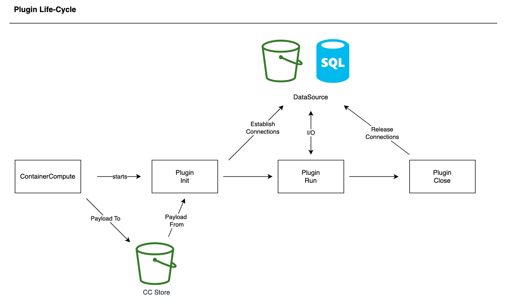

Plugins can optionally use a payload.  A payload is a file created by container compute that describes the variable parameters, inputs, outputs, and actions a compute plugin can perform. 



 The payload file format is json and the file can consist of the following sections:

 - __attributes__</em>: this is a global attributes object containing attribute key value pairs.
 - __stores__: this is an array of store objects.  Sote objects are documented below.
 - __inputs__: this an array of input data sources
 - __outputs__: this is an array of output data sources
 - __actions__: this is an array of actions

## Stores
Stores have the following attributes:
 - name: the name of the store
 - store_type: the type of the store.  types can be added by plugin developers and details for adding custom store types are <a>here</a>. Currently the following types exist:
   - S3: AWS S3 Store
   - TILEDB: TileDB store
 - profile: Stores obtain their connection information from the compute environment.  the profile is the prefix for the environment variables used by the store.  For example a profile of `STORE1` might map to an environment variable of `STORE1_DEFAULT_REGION` for an AWS Service.
 - params: an object of key value pairs describing any attributes necessary to configure the store.

 ## Inputs
 Inputs are an array of data sources for importing data into the plugin.  For example an input can be a file stored in an AWS S3 store.  Inputs have the following attributes:
   - name: The name of the input
   - paths: An input can have one or more paths described as key value pairs.  Most commonly an input is a single file and might have a key of "default" or something similar.  However, in some cases an input might consist of multiple files, such as an ESRI shapefile, and in this case each file in the shapefile would have a key and a value.
   - data_paths: Some data source format such as DSS or HDF5 can have multiple internal data sets.  `data_paths` is an object of key value pairs describing the set of data sources referenced by the input.
   - store_name: This is the name of the store that contains the input.    

## Outputs
Outputs are identical to inputs but describe the data sources for exporting data out of the plugin.  the object format is identical to input.

## Actions
Actions are an array of commands that a plugin will perform.  these are analagous to command line switches and allow a single plugin to perform multiple tasks.  for example a RAS plugin might have an action for running a geometry preprocessor, a second action for running the model, and a third action for exporting gridded output.  The array of actions will be run in sequence and there is no limit on the number of actions that can be included in a payload. Each action in the array can include a private set of input/output options.  This includes attributes, stores, inputs, and outputs


sample payload
```json
{
  "attributes": {
    "event_array": "array1",
    "test123": "TEST123",
    "dir1": "/mydata/dir1"
  },
  "stores": [
    {
      "name": "FFRD",
      "store_type": "S3",
      "profile": "FFRD",
      "params": {
        "root": "/model-library/ffrd-store"
      }
    },
    {
      "name": "EVENT_STORE",
      "store_type": "TILEDB",
      "profile": "FFRD",
      "params": {
        "root": "/model-library/ffrd-store"
      }
    }
  ],
  "inputs": [
    {
      "name": "TestFile",
      "paths": {
       "default":"hw.text"
      },
      "data_paths": null,
      "store_name": "FFRD"
    },
    {
      "name": "TestFile2",
      "paths": {
       "default":"{ATTR::dir1}/hwout.txt"
      },
      "data_paths": null,
      "store_name": "FFRD"
    },
    {
      "name": "TestFile3",
      "paths": {
       "default":"{ENV::CC_ROOT}/test/{ATTR::test123}/hwout.txt"
      },
      "data_paths": null,
      "store_name": "FFRD"
    },
    {
      "name": "TestFile4",
      "paths": {
       "default":"hwout.txt"
      },
      "data_paths": null,
      "store_name": "FFRD"
    }
  ],
  "outputs": [
    {
      "name": "TestFileOut",
      "paths": {
       "default":"hwout.txt"
      },
      "data_paths": null,
      "store_name": "FFRD"
    },
    {
      "name": "TestFileOut2",
      "paths": {
       "default":"hwout2.txt"
      },
      "data_paths": null,
      "store_name": "FFRD"
    }
  ],
  "actions": [
    {
      "attributes": {
        "dataset1":"test"
      },
      "stores": null,
      "inputs": null,
      "outputs": null,
      "type": "test1",
      "description": "test1"
    }
  ]
}

```